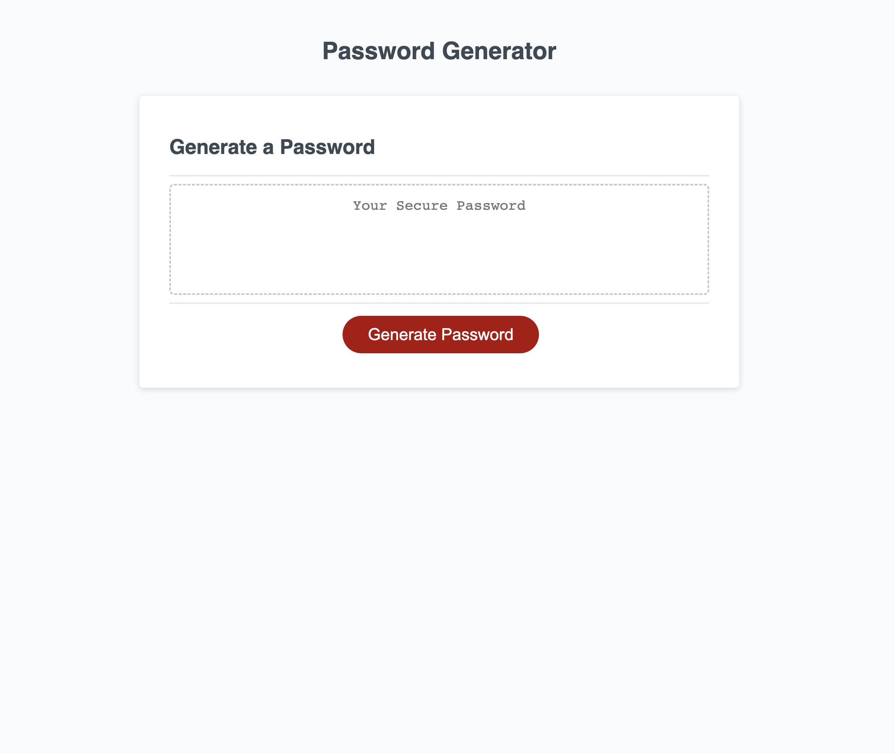

# employee-password-generator

## Overview

As technology advances, it is crucial now more than ever for users to impliment strong passwords to protect their devices from hackers and malicious software. It is vital employees of any sort protect their personal data through advanced password security that includes various characters, and character types.

## features

This application has an abundance of features as follows:

- Gives the user the option to choose their desired password length
- Gives the user the option to include lowercase, uppercase, numeric and/or special charcters in their password
- Selects completely random values within the users desired parameters
- Displays the randomly generated password to the users screen (users can copy this passcode and use it right away!)

Link to the [Live Webpage](https://trishaneww.github.io/employee-password-generator/)

## Credits

Trishane Wijeyawickrema 

Link to [GitHub Repository](https://github.com/Trishaneww/employee-password-generator)

## Liscence

N/A
